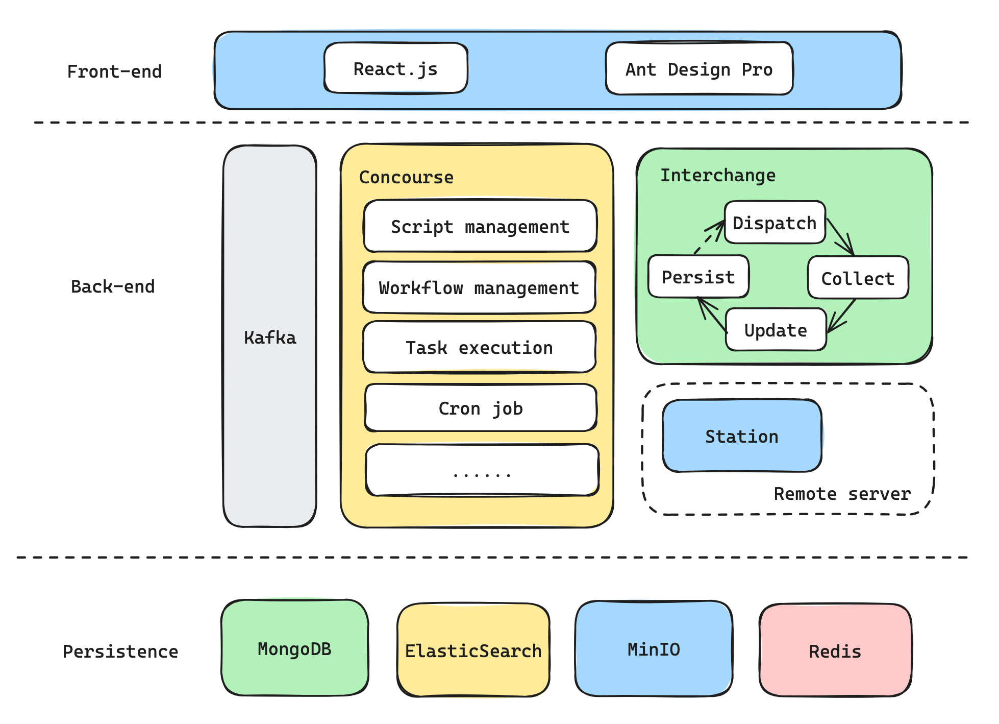

## Introduction

ApisOps is an effective, open-source, high-performance operations automation system tailored for SRE use, adept at handling massive concurrent tasks. Lightweight and extensible, ApisOps offers a practical tool for streamlined integration, user-friendly operation, and extensive adaptability.

## Architecture

ApisOps is developed in multiple languages including Go and TypeScript with a simple, asynchronized, distributed, Event Loop-based architecture.

### Front-end

Built by **React.js**, **TypeScript**, **Ant Design Pro** and **ProComponents**.

### Back-end

Written in **Go**, the back-end services are composed of two separate services: **Concourse** and **Interchange**.

**Concourse**: The entry point of ApisOps, a simple web server based on the MVC model, providing RESTful APIs to manage workflows, scripts, tasks, and cron jobs.

**Interchange**: A high-performance execution service for submitting tasks such as script execution, requesting third-party systems, and file distribution. It also retrieves task logs, converts task status, and persists execution records.

### Client on remote servers

**Station** is a lightweight client that runs on target servers for dispatching files and executing scripts.

### Design considerations

- High concurrency
- Efficient
- Easy to extend
- Keep it simple
- Easy to use
